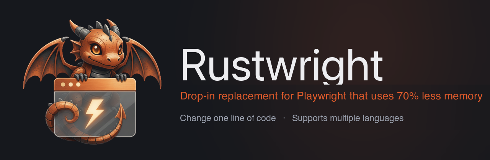

<div align="center">



**A Rust rewrite of Playwright**, the popular browser automation library. Rustwright is interoperable with Playwright but runs on an in-process Rust CDP engine — **2.55× faster on typical operations**, **66% less memory overhead**, and no Playwright automation fingerprint. Alpha; Chromium-only.

[](#project-status)
[](https://github.com/Skyvern-AI/rustwright/actions/workflows/test.yml)
[](LICENSE)
[](pyproject.toml)
[](node/)
[](#limitations)
[](https://discord.gg/fG2XXEuQX3)

</div>

---

## What is Rustwright?

Rustwright is a browser automation library for Python and Node.js that keeps the Playwright API you already know but drives Chromium from a **native Rust engine** speaking raw [Chrome DevTools Protocol](https://chromedevtools.github.io/devtools-protocol/) — no driver subprocess in the path.

```text
playwright-python:  your code ──pipe──► Node driver (separate process) ──CDP──► Chromium
rustwright:         your code ────────────────── raw CDP ─────────────────────► Chromium
```

> [!WARNING]
> **Alpha.** Chromium-only. Need Firefox/WebKit or production maturity today? Use [`playwright-python`](https://github.com/microsoft/playwright-python). Full list: [Limitations](#limitations).

## Quickstart

Rustwright is interoperable with Playwright — install it, change one import, and your existing code runs on the Rust engine.

**Python**

```bash
pip install rustwright
```

```diff
- from playwright.sync_api import sync_playwright
+ from rustwright.sync_api import sync_playwright

  with sync_playwright() as p:
      browser = p.chromium.launch(headless=True)
      page = browser.new_page()
      page.goto("https://example.com")
      print(page.title())
      browser.close()
```

**Node.js**

```bash
npm install @skyvern/rustwright
```

```diff
- import { chromium } from 'playwright';
+ import { chromium } from '@skyvern/rustwright';

  const browser = await chromium.launch();
  const page = await browser.newPage();
  await page.goto('https://example.com');
  console.log(await page.title());
  await browser.close();
```

## Why Rustwright?

- **No Node driver subprocess.** `playwright-python` launches and pipes to a bundled Node driver. Rustwright's engine is native — the browser-control code runs in-process.
- **Raw CDP, in Rust.** A from-scratch async CDP client — not a wrapper around another automation library.
- **No Playwright automation fingerprint.** The driver never loads, so its signatures never appear. See [Anti-bot](#anti-bot).
- **Trusted input by default.** Clicks and typing go through real CDP input events (`Input.dispatchMouseEvent`), not synthetic `element.click()` DOM calls. Untrusted DOM shortcuts are opt-in only.
- **Cross-origin iframes (OOPIF).** Auto-attaches out-of-process iframe targets with flattened CDP sessions and routes `frame_locator()` across origins.
- **One engine, many languages.** The same Rust core can back bindings in many languages; today it powers Python and an experimental Node.js binding.

## How it works

One Rust core — an async CDP client built on Tokio (WebSocket, with opt-in Unix-pipe transport) — talks to Chromium directly, and thin [PyO3](https://pyo3.rs) (Python) and [napi-rs](https://napi.rs) (Node) bindings expose it in-process. The two-line diagram above is the entire architecture.

## Remote browsers (Skyvern)

Rustwright removes the local driver process; [Skyvern Browser Sessions](https://skyvern.com/docs/developers/features/browser-sessions) (from the team behind Rustwright) address the other half — hosting the browser. A session is a persistent cloud browser whose login, cookie, and tab state carry across runs, with configurable timeouts from 5 minutes to 24 hours (60 by default), proxies in 21 countries, and a live view in the Skyvern Cloud UI; sessions bill while open. Creating one returns a `browser_address` CDP endpoint, and Rustwright connects to it like any remote Chromium.

To get a `browser_address`: install the [Skyvern SDK](https://skyvern.com/docs/developers/getting-started/quickstart) (`pip install skyvern`) and copy an API key from [app.skyvern.com](https://app.skyvern.com) → Settings. Then:

```python
import asyncio
from rustwright.async_api import async_playwright
from skyvern import Skyvern

async def main():
    session = await Skyvern(api_key="<SKYVERN_API_KEY>").create_browser_session()

    async with async_playwright() as p:
        browser = await p.chromium.connect_over_cdp(session.browser_address)
        page = await browser.new_page()
        await page.goto("https://example.com")

asyncio.run(main())
```

The sync API connects the same way: `p.chromium.connect_over_cdp(browser_address)`.

## Anti-bot

Because Rustwright never loads Playwright's Node driver, it never emits the automation signatures that ship with it:

- **No Playwright driver signatures** — no `__playwright__binding__` / utility-world globals, no driver bootstrap. The backend reports `playwright_driver: "none"`.
- **No `Runtime.enable` on the default path** — a normal launch + navigate never enables the CDP Runtime domain, closing the `Runtime.enable` console-serialization leak behind `isAutomatedWithCDP`. (Console/page-error/binding opt-ins still enable it lazily — detectable by design.)
- **Headless identity normalized by default** — launches with `--disable-blink-features=AutomationControlled`, rewrites `HeadlessChrome/` → `Chrome/` in the UA and client hints, and installs a `navigator.webdriver` cleanup init script.

Local fingerprint runs — default Playwright failed webdriver/headless checks that Rustwright passed; these are local diagnostics, not a guarantee:

| Probe | Result |
|---|---|
| SannySoft | ✅ Clean |
| BrowserScan | ✅ Clean |
| DeviceAndBrowserInfo | ✅ Clean (after the Runtime-domain cleanup) |
| CreepJS | ⚠️ Detects headless |

> [!IMPORTANT]
> **Rustwright is not "undetectable."** It is not a CAPTCHA or Cloudflare bypass, and it is not fully CDP-invisible — it still uses CDP primitives (`Target.setAutoAttach`, init scripts, and lazy `Runtime.enable` for console event/pageerror event/binding opt-ins). The claim is narrow: **no Playwright-specific automation fingerprint**, plus baseline signal hygiene.

## Benchmarks

Rustwright is faster on the large majority of operations. In capped-Docker CI (warm browser, 3 repetitions × 5 iterations), Rustwright was faster on **67 of 78** strict cases and **13 of 17** equivalent cases — a **median ~2–3× per-operation speedup** (`click_button` ~16×, locators ~5×), which is where the ~2.55× headline comes from.

The catch is honest and specific: five wait/frame operations (`wait_for_selector`, `frame_wait_for_function`, and OOPIF frame handling) currently hit a fixed poll-to-timeout path and run multi-second, so a naive *sum* across every case looks slower even though the typical operation is faster. Those five are a known regression under active fix; with them fixed, the aggregate is faster too.

Memory: with no Node driver, the automation library's own footprint is **~66% smaller** (~41 MB vs ~121 MB for playwright-python's Python + Node driver). Whole-process memory is Chromium-dominated and roughly equal.

Methodology and run records: [`BENCHMARK.md`](BENCHMARK.md).

## Alternatives

| | Rustwright | playwright-python | Puppeteer | Patchright |
|---|---|---|---|---|
| **API** | Playwright-shaped (Py + Node) | Official Python Playwright | JS/TS Puppeteer | Playwright drop-in fork |
| **Engine / transport** | Rust core, raw CDP | Python → Node driver | Node over CDP | Patched PW driver |
| **In-process engine (no driver subprocess)** | ✅ | ❌ bundled Node driver | ✅ Node is the runtime | ❌ Playwright-style driver |
| **Browsers** | Chromium only | Chromium, Firefox, WebKit | Chrome, Firefox | Chromium-based |
| **Default input** | Trusted CDP events | Browser-level | Browser / CDP | Playwright + stealth |
| **Cross-origin iframes** | OOPIF (alpha) | Mature | Frame APIs | Inherits Playwright |
| **Playwright fingerprint** | No | Yes | n/a | Patched |
| **Maturity** | 🟠 Alpha | 🟢 Mature | 🟢 Mature | 🟡 Focused fork |

Rustwright's lane: **a Rust CDP engine under the Playwright API, for Chromium.**

## Limitations

See [`LIMITATIONS.md`](LIMITATIONS.md) for detail.

- **API coverage** — ~96% of Playwright's Python sync API is implemented (**515 of 536** methods); **411** are exercised by the shared parity suite against real Playwright. Full **behavioral** parity is still in progress.
- **Chromium only** — Firefox and WebKit error explicitly.
- **Node bindings are early** — a subset of the surface is bridged (`launch`, `newPage`, `goto`, `click`, `fill`, `title`, `textContent`, `evaluate`, `screenshot`, `close`); contexts, routing, tracing, and locators are Python-only for now.
- **Async concurrency (Python)** — the async API wraps the sync engine via threads; recommended for **≈≤25 concurrent workflows/process**, not high fan-out.
- **Wait/frame latency** — five `wait_for`/OOPIF-frame operations have a known multi-second regression under active fix (see [Benchmarks](#benchmarks)).
- **Anti-bot is partial** — 3 of 4 public fingerprint targets clean in local runs (CreepJS still detects headless). **No undetectability promise.**

## Roadmap

- [ ] **Language bindings** — one Rust engine, many languages: Go, Java, C#/.NET, Ruby, and PHP, plus a native Rust API
- [ ] Fix the wait/frame latency outliers (see [Benchmarks](#benchmarks))
- [ ] Native async engine (remove the Python thread-pool bridge)
- [ ] Broaden the Node.js surface (contexts, routing, locators)
- [ ] Close remaining OOPIF gaps

Recently shipped:

- [x] PyPI + npm release automation
- [x] OOPIF auto-attach with flattened CDP sessions across origins
- [x] `Runtime.enable` console-serialization leak closed on the default path

Firefox and WebKit are **not planned** — Rustwright is deliberately Chromium-only.

## Contributing

Rustwright is Rust + Python + Node. `cargo` builds the engine; `maturin develop --release` installs the Python package; `cd node && npm run build` builds the Node addon; the Python suite exercises the engine against real Chromium. CI (`test.yml`) runs a fast representative subset on every PR; the heavier Docker and cross-library parity gates run the full suite against real Playwright.

See [`CONTRIBUTING.md`](CONTRIBUTING.md) for build details and the code-layout reality.

## Project status

Rustwright is an early alpha from [Skyvern](https://github.com/Skyvern-AI), developed in the open. If the architecture resonates, [give it a ⭐](https://github.com/Skyvern-AI/rustwright).

Questions, ideas, or want to help? Join the Skyvern community on [**Discord**](https://discord.gg/fG2XXEuQX3).

## License

[MIT](LICENSE) © 2026 Ikonomos Inc (dba Skyvern)

<div align="center">
<sub>Built with 🦀🐉 and a lot of CDP frames · <a href="https://github.com/Skyvern-AI/rustwright">Skyvern-AI/rustwright</a></sub>
</div>
