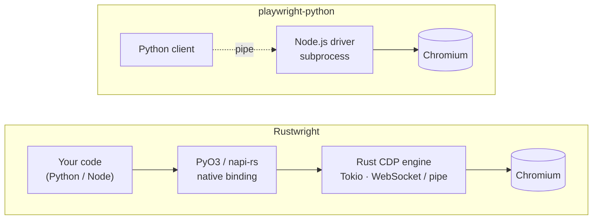

<div align="center">


**Browser automation with the Playwright API you already know — powered by an in-process Rust engine that speaks Chrome DevTools Protocol directly. No Node driver subprocess. No Playwright automation fingerprint. Available for Python and Node.js.**

[](#project-status)
[](LICENSE)
[](pyproject.toml)
[](node/)
[](Cargo.toml)
[](#limitations)
[](https://discord.gg/fG2XXEuQX3)

</div>

---

> [!WARNING]
> **Rustwright is an alpha.** It is Chromium-only, targets the Playwright **API shape** (not full behavioral parity yet), and has no package published yet — you build it from source today. See [Limitations](#limitations) before you depend on it.

## What is Rustwright?

[`playwright-python`](https://github.com/microsoft/playwright-python) is a Python client that drives a **bundled Node.js driver subprocess** — every call crosses a Python↔Node pipe before it reaches the browser.

Rustwright keeps the same ergonomic API but replaces that driver with a **native Rust engine** (built with [PyO3](https://pyo3.rs) for Python and [napi-rs](https://napi.rs) for Node) that talks to Chromium over raw [Chrome DevTools Protocol](https://chromedevtools.github.io/devtools-protocol/). No Node runtime in the Python path. No driver process. And because it never loads Playwright's driver, it never emits Playwright's automation fingerprint.

```text
Rustwright:          Your code  →  Rust CDP engine  →  Chromium
playwright-python:   Python     →  Node driver subprocess  →  Chromium
```

## Change one import

Rustwright is designed to be a drop-in for existing Playwright code. In most cases, you change a **single line** — the import — and keep the rest.

<table>
<tr>
<td width="50%" valign="top">

**Python**

```diff
- from playwright.sync_api import sync_playwright
+ from rustwright.sync_api import sync_playwright

  with sync_playwright() as p:
      browser = p.chromium.launch(headless=True)
      page = browser.new_page()
      page.goto("https://example.com")
      print(page.title())
      browser.close()
```

</td>
<td width="50%" valign="top">

**Node.js**

```diff
- const { chromium } = require('playwright');
+ const { chromium } = require('rustwright');

  const browser = await chromium.launch({ headless: true });
  const page = await browser.newPage();
  await page.goto('https://example.com');
  console.log(await page.title());
  await browser.close();
```

</td>
</tr>
</table>

Prefer not to touch imports at all? Python offers an opt-in shim — `rustwright.enable_playwright_compat()` — that redirects `import playwright...` to Rustwright at runtime.

## Install

No package is published yet — Rustwright is built from source. You need a [Rust toolchain](https://rustup.rs/) (1.85+).

**Python** (3.8+)

```bash
git clone https://github.com/Skyvern-AI/rustwright && cd rustwright
python -m venv .venv && source .venv/bin/activate
python -m pip install -U pip maturin
maturin develop --release               # compile the Rust engine + install the package
python -m rustwright install chromium   # fetch a Chromium build
```

Keep the virtual environment activated when running `maturin develop`; maturin can print a success message while installing nothing into a non-active environment. If `import rustwright` later raises `ModuleNotFoundError`, activate it with `source .venv/bin/activate` and rerun `maturin develop --release`.

**Node.js** (experimental)

```bash
cd rustwright/node
npm install
npm run build                            # builds the native addon via napi-rs
```

Already have a Chromium/Chrome binary? Point Rustwright at it with `RUSTWRIGHT_CHROMIUM`, `CHROME`, or `CHROMIUM`.

## Why Rustwright?

- **No Node driver subprocess.** `playwright-python` launches and pipes to a bundled Node driver. Rustwright's engine is native — the browser-control code runs in-process.
- **Raw CDP, in Rust.** A from-scratch async CDP client (Tokio + WebSocket, opt-in Unix-pipe transport) — not a wrapper around another automation library.
- **No Playwright automation fingerprint.** See [Signal hygiene](#signal-hygiene) below.
- **Trusted input by default.** Clicks and typing go through real CDP input events (`Input.dispatchMouseEvent`), not synthetic `element.click()` DOM calls. Untrusted DOM shortcuts are opt-in only.
- **Cross-origin iframes (OOPIF).** Auto-attaches out-of-process iframe targets with flattened CDP sessions and routes `frame_locator()` across origins.
- **One engine, two languages.** The same Rust core backs the Python and Node bindings.

## Signal hygiene

Rustwright drives Chromium through its **own raw-CDP Rust core** and never ships Playwright's Node driver. That means it does not emit the automation signatures that ship *with* that driver:

- **No Playwright driver signatures** — no `__playwright__binding__` / utility-world globals, no driver bootstrap. The backend reports `playwright_driver: "none"`.
- **No `Runtime.enable` on the default path** — a normal launch + navigate never enables the CDP Runtime domain, closing the `Runtime.enable` console-serialization leak behind `isAutomatedWithCDP`. (Console/page-error/binding opt-ins still enable it lazily — detectable by design.)
- **Headless identity normalized by default** — launches with `--disable-blink-features=AutomationControlled`, rewrites `HeadlessChrome/` → `Chrome/` in the UA and client hints, and installs a `navigator.webdriver` cleanup init script.
- **Measured, not marketed** — in local fingerprint runs Rustwright now reads clean on SannySoft, BrowserScan, and DeviceAndBrowserInfo (the last flipped after the Runtime-domain cleanup); CreepJS still reports high headless confidence. Default Playwright failed webdriver/headless checks that Rustwright passed. These are local diagnostics, not a guarantee.

> [!IMPORTANT]
> **Rustwright is not "undetectable."** It is not a CAPTCHA or Cloudflare bypass, and it is not fully CDP-invisible — it still uses CDP primitives (`Target.setAutoAttach`, init scripts, and lazy `Runtime.enable` for console event/pageerror event/binding opt-ins). The honest claim is narrow and true: **no Playwright-specific automation fingerprint**, plus baseline signal hygiene.

## How it works



## Benchmarks

> [!NOTE]
> **We do not headline a speed number yet.** Rustwright's benchmark policy requires launch-facing claims to come from reproducible, isolated CI (Testbox + capped Docker). That evidence is **not yet published**. Treat the figures below as **local diagnostics**, not a launch claim.

Local diagnostic — `equivalent` suite, 17 cases, 5 iterations, warm browser, single dev host:

| | Total mean | Relative |
|---|---:|---:|
| **Rustwright** | **5,256 ms** | 1.0× |
| playwright-python | 13,418 ms | 2.55× |

Rustwright won 16/17 case means. **Caveats:** local host, warm-browser, not capped-Docker or CI evidence; a hosted 78-case strict run showed a narrower ~37% gap. Methodology in [`BENCHMARK.md`](BENCHMARK.md).

## Rustwright vs the alternatives

| | Rustwright | playwright-python | Puppeteer | Patchright |
|---|---|---|---|---|
| **API** | Playwright-shaped (Py + Node) | Official Python Playwright | JS/TS Puppeteer | Playwright drop-in fork |
| **Engine / transport** | Rust core, raw CDP | Python → Node driver | Node over CDP | Patched PW driver |
| **Node driver process** | ❌ none | ✅ bundled | (Node is runtime) | ✅ Playwright-style |
| **Browsers** | Chromium only | Chromium, Firefox, WebKit | Chrome, Firefox | Chromium-based |
| **Default input** | Trusted CDP events | Browser-level | Browser / CDP | Playwright + stealth |
| **Cross-origin iframes** | OOPIF (alpha) | Mature | Frame APIs | Inherits Playwright |
| **Playwright fingerprint** | ❌ not emitted | ✅ present | n/a | patched |
| **Maturity** | 🟠 Alpha | 🟢 Mature | 🟢 Mature | 🟡 Focused fork |

Rustwright's honest lane: **a Rust CDP engine under the Playwright API, for Chromium.** If you need Firefox/WebKit or production maturity, reach for `playwright-python` today.

## Limitations

See [`LIMITATIONS.md`](LIMITATIONS.md) for detail.

- **Alpha** — API shape covered; full **behavioral** parity not yet proven.
- **Chromium only** — Firefox and WebKit error explicitly.
- **Node bindings are early** — a subset of the surface is bridged (`launch`, `newPage`, `goto`, `click`, `fill`, `title`, `textContent`, `evaluate`, `screenshot`, `close`); contexts, routing, tracing, and locators are Python-only for now.
- **Async concurrency (Python)** — the async API wraps the sync engine via threads; recommended for **≈≤25 concurrent workflows/process**, not high fan-out.
- **OOPIF** — residual gaps in non-main-frame `JSHandle` follow-ups and drag/screenshot/bounding-box.
- **Signal hygiene is partial** — 3 of 4 public fingerprint targets clean in local runs (CreepJS still detects headless). **No undetectability promise.**

## Roadmap

- [ ] CI / Testbox-backed benchmark evidence
- [ ] Native async engine (remove the Python thread-pool bridge)
- [ ] Broaden the Node.js surface (contexts, routing, locators)
- [ ] Close remaining OOPIF gaps
- [ ] Split the core into maintainable modules

## Contributing

Rustwright is Rust + Python + Node. `cargo` builds the engine; `maturin develop --release` installs the Python package; `cd node && npm run build` builds the Node addon; the Python suite exercises the engine against real Chromium. Full Docker gate: **1,046 tests pass** (6 skipped), plus **515/515** shared parity cases run against real Playwright; CI (`test.yml`) runs a fast representative subset on every PR.

See [`CONTRIBUTING.md`](CONTRIBUTING.md) for build details and the code-layout reality.

## Project status

Rustwright is an early alpha from [Skyvern](https://github.com/Skyvern-AI), developed in the open and honestly labeled. If the architecture resonates, [give it a ⭐](https://github.com/Skyvern-AI/rustwright).

Questions, ideas, or want to help? Join the Skyvern community on [**Discord**](https://discord.gg/fG2XXEuQX3).

## License

[MIT](LICENSE) © 2026 Ikonomos Inc (dba Skyvern)

<div align="center">
<sub>Built with 🦀🐉 and a lot of CDP frames · <a href="https://github.com/Skyvern-AI/rustwright">Skyvern-AI/rustwright</a></sub>
</div>
